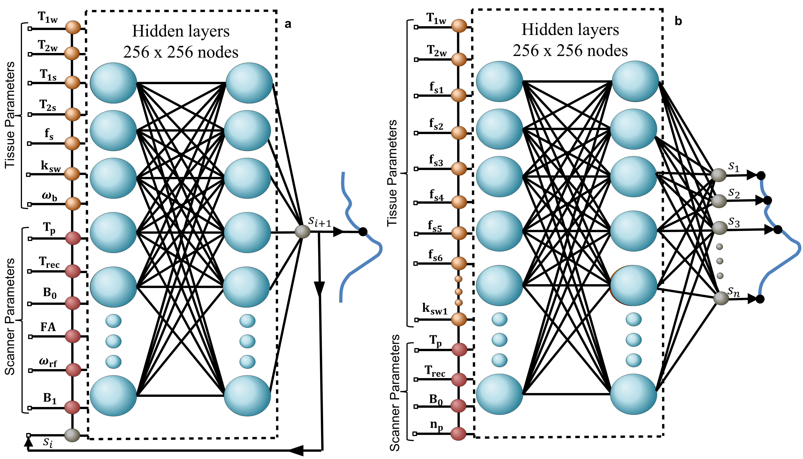

<div align="center">


<h1>Dynamic and Rapid Deep Synthesis of Molecular MRI Signals
</h1>

  

<div>
    <h4 align="center">
        <a href="https://arxiv.org/abs/2305.19413" target='_blank'>
        
        </a> 
        
    </h4>

</div>
【<a href='https://github.com/DinorNagar' target='_blank'>Dinor Nagar</a> |
<a href='https://github.com/operlman' target='_blank'>Or Perlman</a> |
<a href='https://github.com/vnikale' target='_blank'>Nikita Vladimirov</a>】
<div>
<a href='https://mri-ai.github.io/' target='_blank'>Momentum Lab, Tel Aviv University</a>
</div>
</div>


## 📚 Overview

<strong>Molecular-MRI-generator </strong> is an open-source deep learning framework developed to accelerate
 molecular MRI simulations and signal dictionary generation compared to traditional numerical Bloch-McConnell solvers.
The code generates the predicted MRI signals that correspond to a set of tissue and scanner parameters.

Two architectures are available:
- <strong>Dynamic network</strong> - trained to accomodate 9 different acquisition protocol, so that each prediction calculates
the next signal element in the trajectory given the previous element. The acquisition protocols may generate any desired signal length.
- <strong>Application optimized network</strong> - designed for a case where a research group is interested in
investigation a specific acquisition protocol with a predefined signal length. This network typically results in an even faster inference.

Additional details are available at: https://doi.org/10.48550/arXiv.2305.19413


## ⚡ Getting Started

### Setting up the environment

1. Clone the repository
```bash
git clone https://github.com/DinorNagar/Molecular-MRI-Generator.git
```

2. The following Python packages are required:

numpy, scipy, tensorflow, keras, matplotlib

They can either be installed manually, or via the following pip/Conda files:

* pip enviroment:
```bash
pip install -r requirements.txt
```
* conda enviroment:
```bash
conda env create -f enviroment.yml
```

## 🏄🏻 Prediction Example
For setting an example, we added the pretrained weights for both of the networks, in addition to an example dictionary for every dictionary.
Run the following commands to try it out:

```bash
# An example for the Dynamic network
python predict_dynamic.py

#An example for the Application optimized network
python predict_application_optimized.py
```

For each example, the results will appear in `stats` folder which is located on the path `example_scenarios\*` where `*` indicates one of the two network directory.<br />
After running the corresponding example script, the following files will be created:
* __trajectories.png__ - One predicted scenario trajectory and the corresponding ground truth. 
* __statistical_graph.png__ - Graph of the predicted elements of the signal compared to the ground truth elements.
* __predicted_dict.mat__ - The new predicted dictionary created by the model for  the specific scenario.
* __stats.txt__ - Text file which saves the calculated statistical coefficient results.

## 🏋️ Optional: Training The Model
For the case of testing new acquisition protocols, we attached the code for the training phase. 

### 1. Organizing the data

For efficient arrangement, make sure that the folder tree which contains both the scripts and the datasets,
looks like the following tree:

```
dataset-dynamic
   |- example-protocol-1
   |- example-protocol-2
   ...
dataset-application-optimized
   |- example-protocol-1
   |- example-protocol-2
   ...   
  
train-script-1
train-script-2
...
```

Before setting up the framework,we first need to create the "ground truth" reference simulated data for training or evaluating the model. We used
the Bloch-McConnell simulator that can be found <a href=https://github.com/operlman/cest-mrf target=https://github.com/operlman/cest-mrf>here</a>. This simulator
was implemented in MATLAB and the data is stored in dictionaries saved as .mat files. To arrange the dataset
efficiently, for every simulated acquisition protocol we saved multiple dictionaries that describes multiple scenarios
of different values of input tissue and scanner parameters. Each dictionary was named by the values of the scanner parameter.
Furthermore, for every dictionary we created a text file with the same name that contains the values of the parameter B1.

An example to such dataset for a specific protocol is described below:

```
L-arginine
   |- dict_tp_1_Trec_1_B0_3_angle_60.mat
   |- dict_tp_1_Trec_1_B0_3_angle_60.txt
   |- dict_tp_1_Trec_1_B0_11.7_angle_90.mat
   |- dict_tp_1_Trec_1_B0_11.7_angle_90.txt
   ...
```

For protocols that have also changing values for the parameter offset_ppm, we also included a text file in the same
manner with an addition of 'ppm' to the name of the file.
An example to such case is described below:

```
MT
   |- dict_tp_1_Trec_1_B0_3_angle_60.mat
   |- dict_tp_1_Trec_1_B0_3_angle_60.txt
   |- dict_tp_1_Trec_1_B0_3_angle_60ppm.txt
   |- dict_tp_8_Trec_8_B0_11.7_angle_90.mat
   |- dict_tp_8_Trec_8_B0_11.7_angle_90.txt
   |- dict_tp_8_Trec_8_B0_11.7_angle_90ppm.txt
   ...
```


### 2. Running the training on the new dataset
After arranging the data, run the following code according to the desired case:

### Dynamic Network
For the dynamic network, run the following script:
```bash
python train_dynamic_network.py
```

### Application Optimized Network
For the application optimized network, run the following script:
```bash
python train_application_optimized_network.py
```

## 🚀 Contributing
We believe in openly sharing information between research group and contribute data. 
Whether you have a question or a bug to fix, please let us know. See our group websited at: https://mri-ai.github.io/


## 📑 References
If you use this code for research or software development please reference the following preprint:
``` # TO CHANGE
Nagar, D., Vladimirov, N., Farrar, C. T., & Perlman, O. (2023). Dynamic and Rapid Deep Synthesis of Molecular MRI Signals. arXiv:2305.19413.‏ https://doi.org/10.48550/arXiv.2305.19413
```

